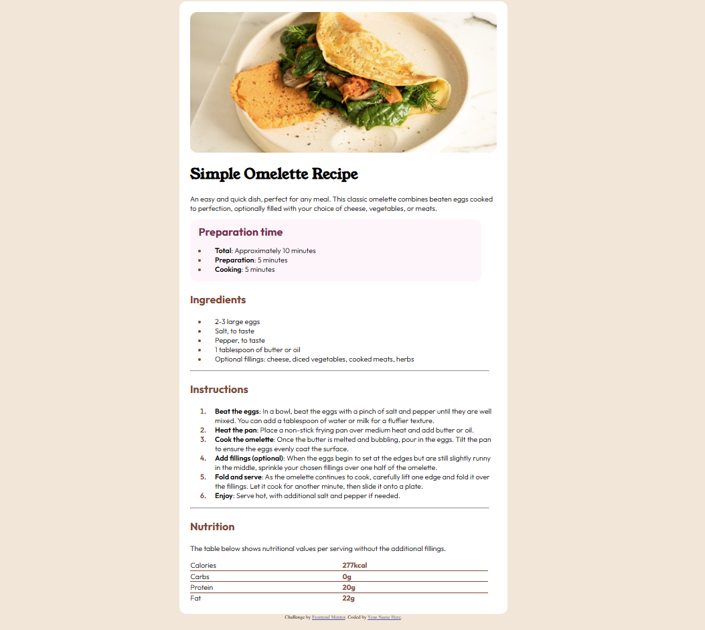

# Frontend Mentor - Recipe page solution

This is a solution to the [Recipe page challenge on Frontend Mentor](https://www.frontendmentor.io/challenges/recipe-page-KiTsR8QQKm). Frontend Mentor challenges help you improve your coding skills by building realistic projects.

## Table of contents

- [Overview](#overview)
  - [The challenge](#the-challenge)
  - [Screenshot](#screenshot)
  - [Links](#links)
- [My process](#my-process)
  - [Built with](#built-with)
  - [What I learned](#what-i-learned)
  - [Continued development](#continued-development)

## Overview

### Screenshot

### Links

- Solution URL: [Github Link](https://github.com/Sihle97/recipe-page)
- Live Site URL: [Live Site](https://sihle97.github.io/recipe-page)

## My process

### Built with

- Semantic HTML5 markup
- CSS custom properties

### What I learned

What I picked up are tricks to make your page more responsive like using clamp for padding and using auto for height properties to ensure that the block length sticks to the content size. The margin-inline:auto was also a nifty little bright to get thigns align on the horizontal axis.

### Continued development

Even more focus on responsive design and ensuring that a pick up all tricks that ensure that my design remains responsive.
